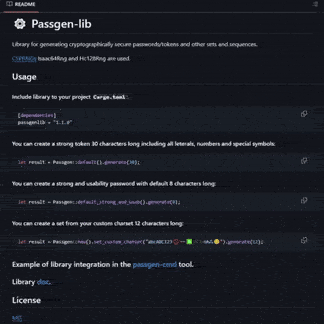

[](https://crates.io/crates/passgen-lib)
[](https://crates.io/crates/passgen-lib)
[](https://docs.rs/passgen-lib/)
[](https://choosealicense.com/licenses/mit/)
[](https://github.com/mammothcoding/passgen-lib/actions/workflows/rust.yml)
[](https://www.rust-lang.org/)

Readme на разных языках:
[EN](https://github.com/mammothcoding/passgen-lib/blob/master/README.md)
[RU](https://github.com/mammothcoding/passgen-lib/blob/master/README.ru.md)

# ⚙ Passgen-lib

Библиотека для генерации криптографически защищенных паролей/токенов и других наборов и последовательностей.

Используются [CSPRNGs](https://rust-random.github.io/book/guide-rngs.html#cryptographically-secure-pseudo-random-number-generators-csprngs) Isaac64Rng и Hc128Rng.



## Использование

#### Включение библиотеки в свой проект `Cargo.toml`:

```toml
[dependencies]
passgen-lib = "1.3.0"
```

#### Создать токен, включающий все прописные буквы и цифры длиной 30 символов:

```rust
use passgenlib::Passgen;
let result = Passgen::new().set_enabled_letters(true).set_enabled_numbers(true).generate(30);
```

#### Создать пароль, включающий все литералы, цифры и специальные символы длиной 12 символов:

```rust
use passgenlib::Passgen;
let result = Passgen::default().generate(12);
```

#### Создать стойкий и удобный пароль длиной 8 символов. Включающий все литералы и цифры, где в первой позиции будет заглавная или прописная буква, а в конце будет один из символов.

🔸 В наборе будут исключены следующие двоякочитаемые символы: `"0oOiIlL1"`.

```rust
use passgenlib::Passgen;
let result = Passgen::default_strong_and_usab().generate(8);
```
#### Сгенерировать криптостойкую случайную строку из вашего набора длиной 8 символов:

```rust
use passgenlib::Passgen;
let result = Passgen::new().set_custom_charset("abcABC123⭕➖❎⚫⬛п₼⁂🙂").generate(8);
```

#### Проверить существующий пароль на соответствие установленным правилам:

```rust
use passgenlib::Passgen;
let mut generator = Passgen::default();
generator.set_enabled_letters(true).set_enabled_numbers(true);
generator.set_password("MyP@ssw0rd");
assert!(generator.validate_password());
```

#### Получить оценку сложности пароля (0-100):

```rust
use passgenlib::Passgen;
let mut generator = Passgen::default();
generator.set_password("MyP@ssw0rd");
let score = generator.password_strength_score();
assert!(score >= 0 && score <= 100);
```

#### Получить описание уровня сложности пароля на разных языках:

```rust
use passgenlib::{Passgen, passgenlib::lang::lang::Language};
let mut generator = Passgen::default();
generator.set_password("MyP@ssw0rd");

// Английский (по умолчанию)
assert_eq!(generator.password_strength_level(), "Strong");

// Русский
generator.set_language(Language::Russian);
assert_eq!(generator.password_strength_level(), "Сильный");

// Испанский
generator.set_language(Language::Spanish);
assert_eq!(generator.password_strength_level(), "Fuerte");
```

#### Сгенерировать пароль и сразу получить его оценку сложности:

```rust
use passgenlib::Passgen;
let mut generator = Passgen::default();
let password = generator.generate(12);

// Сгенерированный пароль сохраняется в поле password
assert_eq!(generator.get_password(), password);

// Можно сразу получить оценку сложности
let score = generator.password_strength_score();
assert!(score > 0);
```
#### Поддерживаемые языки для вывода описания уровней сложности:
🔸Английский (по умолчанию)
🔸Китайский (简体中文)
🔸Испанский (Español)
🔸Хинди (हिन्दी)
🔸Арабский (العربية)
🔸Португальский (Português)
🔸Бенгальский (বাংলা)
🔸Русский
🔸Японский (日本語)
🔸Панджаби (ਪੰਜਾਬੀ)
🔸Немецкий (Deutsch)
🔸Корейский (한국어)
🔸Французский (Français)
🔸Турецкий (Türkçe)
🔸Итальянский (Italiano)

### Пример интеграции библиотеки в нашем инструментарии [passgen-cmd](https://github.com/mammothcoding/passgen-cmd) и [passgen-telegram](https://github.com/mammothcoding/passgen-telegram) сервис.

### Документация [тут](https://docs.rs/passgen-lib/).

## Лицензия

[MIT](https://choosealicense.com/licenses/mit/)
### Другие проекты для генерации паролей
[passgen-desktop](https://github.com/mammothcoding/passgen-desktop)

[passgen-console-linuxwin](https://github.com/mammothcoding/passgen-console-linuxwin)

[passgen-cmd](https://github.com/mammothcoding/passgen-cmd)

[passgen-telegram](https://github.com/mammothcoding/passgen-telegram)
